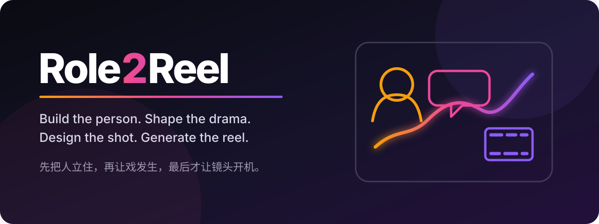

<p align="center">
  
</p>

<p align="center">
  <a href="https://github.com/niuyupeng/role2reel/actions/workflows/validate.yml"></a>
  <a href="LICENSE"></a>
  
</p>

# Role2Reel

**Build the person. Shape the drama. Design the shot. Generate the reel.**

Role2Reel is a human-first Codex skill that combines two systems in one production chain: the original humanization → CharacterOS → natural dialogue → scene → storyboard → video-direction system, and **命线反演** (fictional life-path reverse inference), a writer-controlled way to infer several possible fictional lives from a character's sparse present.

**先把人立住，再让戏发生，最后才让镜头开机。**

它解决的不是“怎么多写一点电影术语”，而是一个更根本的问题：AI 经常让角色轮流解释现场，却没有让角色基于自己的经历、知识边界、关系和风险做出判断。

```text
raw material
  -> meaning-preserving humanization
  -> 命线反演: several surprising-but-plausible pasts from present traces
  -> author select / edit / splice / reject / keep unknown
  -> causal deep biography / exact-revision approval
  -> cognitive-resource library + speech corpus
  -> memory / relationship / knowledge / common ground
  -> private interpretation / judgment / strategy
  -> action / gaze / pause / silence / minimum necessary dialogue
  -> shots with an audience-facing duty
  -> continuity-safe, single-mode video tasks
```

## What makes it different

| Layer | Role2Reel asks |
|---|---|
| Humanization | What did the speaker actually mean, who owns the claim, and how certain are they? |
| 命线反演 | What radically different lives could have produced these same present traces—and which parts does the writer choose? |
| CharacterOS | What can this person notice, know, remember, infer, misunderstand, want, risk, and say in this relationship now? |
| Dialogue | What change are they trying to produce in the other person, and what do they withhold? |
| Scene | What changes in information, power, intimacy, intention, emotion, or physical state? |
| Storyboard | Why must this shot exist for the audience? |
| Video prompt | What does each reference asset contribute—and what must it never leak? |

The central rule is simple:

> **A character's private interpretation can be rich. Their visible explanation should be restrained.**

The resulting surface may be an action, a change in distance, a look, a stopped movement, a pause, silence, or—only when the current strategy still needs it—a line. The audience can feel a lived past without receiving a spoken biography.

## 命线反演

Give Role2Reel a story outline, half a script, a short character note, or only a few present-day traces. It reads the present the way a compelling fictional “life reading” would: not to announce one hidden truth, but to expose several lives the summary label has concealed.

Each reading must have a different causal engine, not merely different dates or credentials. It shows what the path explains, what it leaves unresolved, which cost still exists in the body or relationships, what story the character tells themself, and what they would notice or do first when the film opens. At least one is a counter-reading that resists the obvious interpretation. Effort may coexist with avoidance; support with debt; agency with pressure; success with damage; uneventful years with a late turn.

The writer stays in charge:

```text
“选 B。”
“把 A 的第二阶段和 C 的结尾拼起来，冲突处先留白。”
“这三条都不对，再来三条，别再写成体面上升线。”
```

Only after that creative decision does Role2Reel materialize the audit record and expand the chosen route. IDs and hashes stay backstage; the writer sees readable lives first.

Role2Reel treats a current identity, relationship, achievement, or other summary label as a constraint—not a personality. The same visible present can be reached through materially different lives. It separates facts, traces, testimony, rumors, unknowns, and conflicts; presents at least three causally different readings; and gives the writer full authority to select, edit, combine, reject, regenerate, lock, or later unlock them. The eventual production lock is bound to one stable character package and exact source snapshot. A locked causal branch may be expanded, but it enters screenplay runtime only after the writer separately approves that exact biography revision.

For a consequential character marked `deep`, the locked-path Chinese biography defaults to at least 30,000 countable Han characters. It must contain ordinary life as well as turning points: relationships forming and fraying, failed attempts, avoidance, work, habits, changing values, debts, misremembering, and present residue. Candidate readings stay compact until selection, so length is spent on the chosen life rather than padded alternatives. Mechanical checks can verify provenance, revision, length, and obvious repetition; causal density, individuality, relationship truth, and actor usefulness still need people. 命线反演 is a fiction-development instrument—not factual divination, profiling, diagnosis, or a way to recover a real person's private history.

The result should remain mostly invisible on screen:

```text
locked-life residue + present relationship and risk
  -> comprehension retrieval -> private interpretation -> belief update
  -> judgment / stance / social objective
  -> speech-corpus retrieval or suppression
  -> action / distance / gaze / pause / silence / necessary dialogue
```

Occupation can supply a tool after that appraisal. It does not get to decide who the person is.

## Install in Codex

Recommended: ask the built-in installer to install this repository.

```text
$skill-installer Install the Role2Reel skill from https://github.com/niuyupeng/role2reel
```

For a manual user-scoped install, clone into the current Codex user skill location.

macOS / Linux:

```bash
mkdir -p "$HOME/.agents/skills"
git clone https://github.com/niuyupeng/role2reel.git "$HOME/.agents/skills/role2reel"
cd "$HOME/.agents/skills/role2reel"
```

Windows PowerShell:

```powershell
New-Item -ItemType Directory -Force -Path "$env:USERPROFILE\.agents\skills" | Out-Null
git clone https://github.com/niuyupeng/role2reel.git "$env:USERPROFILE\.agents\skills\role2reel"
Set-Location -LiteralPath "$env:USERPROFILE\.agents\skills\role2reel"
```

Restart or open a new Codex task if the skill is not discovered immediately, then invoke it explicitly:

```text
$role2reel 把这段口述整理成人说得出口的对白，再按状态变化做分镜。
```

The repository root is the skill folder: `SKILL.md`, `agents/`, `references/`, `assets/`, and `scripts/` travel together.

For a manual install, update with `git -C <skill-directory> pull --ff-only`. To uninstall, remove only the `role2reel` directory under `$HOME/.agents/skills` (or `$env:USERPROFILE\.agents\skills` on Windows), then restart Codex. Save or commit local changes before updating or removing the directory.

## Use it

Role2Reel routes to the narrowest requested workflow. You do not need to run the whole pipeline.

```text
$role2reel 只改错别字和标点，不要润色这段档案访谈。
```

```text
$role2reel 根据人物各自知道的信息，写一场有潜台词的两人对白。
```

```text
$role2reel 从这份大纲、人物小传和已写场景中分离事实、痕迹、未知与冲突，先给我至少三条因果不同的人生路径；等我选择或修改后再继续。
```

```text
$role2reel 对这个虚构人物做一次“命线反演”：同一个开场现状，给我四种真正不同的过去，其中至少一条反直觉。先给可读的人生方案，不要替我选，不要展开三万字。
```

```text
$role2reel 把我锁定的人生路径扩写成 deep 级中文人物小传；通过机械审计后，等我批准这份小传的准确 revision 与 body hash，再编译为人物、记忆、关系、共同语境和场景运行资产。
```

```text
$role2reel 把这场戏做成 28 秒分镜；按观众需要感知的变化拆镜，不按台词拆镜。
```

```text
$role2reel 把分镜适配成视频生成提示词。逐个锁定参考图、动作视频和声音素材的职责。
```

For a persistent production workspace, the installation-independent route is to ask the skill to initialize it:

```text
$role2reel 在当前工作目录初始化 my-film 项目，人物是“角色甲、角色乙”，首场戏编号 scene-001。
```

For a direct CLI call after a manual clone, run this from the repository root:

```bash
python3 scripts/init_project.py ./my-film --characters "角色甲,角色乙" --scene scene-001
```

On Windows, use `py -3` in place of `python3` for the direct CLI and validation commands below.

The initializer never overwrites existing files unless `--force` is supplied explicitly.
If a workspace already has scene and relationship contracts, adding a new participant without updating those contracts is rejected. Use `--profiles-only` only when you deliberately want an unlinked standalone profile; otherwise rerun with `--force` and the complete initial-scene participant list.

## Included production system

- persistent meaning-ledger humanization that preserves uncertainty and authorship;
- author-facing 命线反演 readings plus backstage multi-candidate locks, separate exact-biography approval, 30,000-Han-character deep-biography gates, downstream provenance, and counterfactual tests;
- CharacterOS with separate cognitive-resource and speech-corpus libraries, two-stage retrieval, episodic memory, relationship ledger, knowledge boundary, common ground, and second-order belief;
- shared-memory contracts for mutual knowledge, private meanings, looks, codes, jokes, taboos, and compressed nonverbal exchange;
- scene contract, private goals, turn-state simulation, and beat mapping;
- natural Chinese dialogue guidance based on judgment and interaction rather than filler words;
- shot-duty storyboarding, motivated camera, causal performance, physics, sound, and continuity;
- provider-neutral single-mode video-task contracts, deny-by-default asset roles, exact causal timelines, and a Seedance downstream adapter that requires current-interface verification at execution time;
- reusable YAML, CSV, Markdown, and Fountain templates;
- deterministic project initialization, dialogue linting, storyboard timing checks, packaging, and repository validation;
- life-path and staged-evaluation auditors for exact fact/candidate/biography/artifact bindings, without claiming to score artistic quality;
- forward-evaluation specifications for fidelity, subtext, shot duty, asset isolation, restraint, life-path counterfactuals, and staged deep compilation. FT-15–FT-17 now have retained informal failure→repair→rerun records; FT-19–FT-22 have partial video-mode behavior checks. FT-14, FT-18, executable provider runs, and blinded human evaluation remain pending.

## Validate locally

Run the complete local gate from the repository or installed skill root:

```bash
python3 -m pip install -r requirements-dev.txt
python3 scripts/validate_repo.py
python3 -m unittest discover -s tests -v
python3 scripts/package_skill.py
```

PyYAML is the declared dependency for YAML templates and the YAML-capable production auditors. Initialization, packaging, dialogue auditing, and CSV/JSON storyboard timing checks otherwise use the Python standard library; the bundled scripts make no network requests.

The linters deliberately report review signals rather than claiming to measure artistic quality. Behavioral cases under `tests/forward/` separate machine-checkable invariants from blinded human judgment.

See [EVALS.md](EVALS.md) for the historical release record, current deterministic checks, development cold-run failures and post-fix regressions, and the still-pending production-deep and human evaluations.

## Design boundaries

Role2Reel does **not**:

- turn uncertainty into fact or invent evidence to make a rewrite smoother;
- infer a personality from an occupation, school, credential, status, diagnosis, zodiac sign, or other category;
- present 命线反演 readings as recovered truth about a real person, assign them probabilities, or let an unlocked branch enter canon;
- give every character the author's knowledge;
- require dialogue or narration in every shot;
- impose a universal shot length, hook, camera move, or marketing CTA;
- assume remembered limits for Seedance or any other changing video product;
- promise a higher adoption rate without blinded, comparable human evaluation.

## Repository map

```text
SKILL.md                  skill router and invariants
agents/openai.yaml        Codex UI metadata
references/               task-specific creative and production guidance
assets/templates/         reusable project contracts
scripts/                  initializer, audits, validation, packaging
tests/                    unit and forward-evaluation cases
docs/                     public-facing visual assets
```

## Origins and independence

Role2Reel was independently implemented from a user-developed character-judgment hypothesis and a review of two MIT-licensed community projects. It does not copy their source code, prose, prompt examples, templates, tests, or assets. Exact review commits and attribution are recorded in [THIRD_PARTY_NOTICES.md](THIRD_PARTY_NOTICES.md).

Role2Reel is not affiliated with, endorsed by, or sponsored by ByteDance, Dreamina, Jimeng, Seedance, OpenAI, or the referenced community projects. Product names and trademarks belong to their respective owners.

## Contributing

The most valuable contribution is not another universal writing rule. It is a reproducible failure case, a human final edit, and a reason why the candidate was accepted, modified, or rejected. See [CONTRIBUTING.md](CONTRIBUTING.md).

## License

[MIT](LICENSE) © 2026 niuyupeng and Role2Reel contributors.
